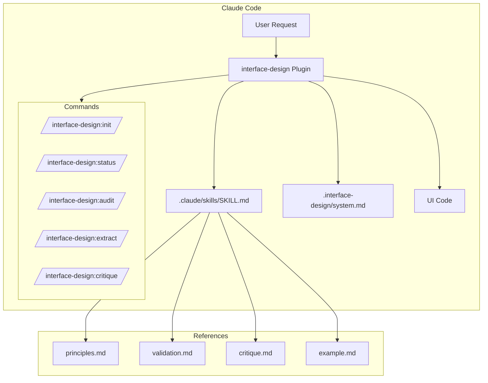
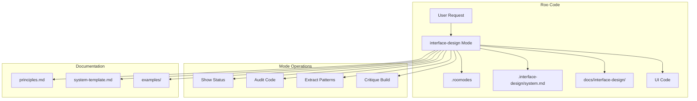
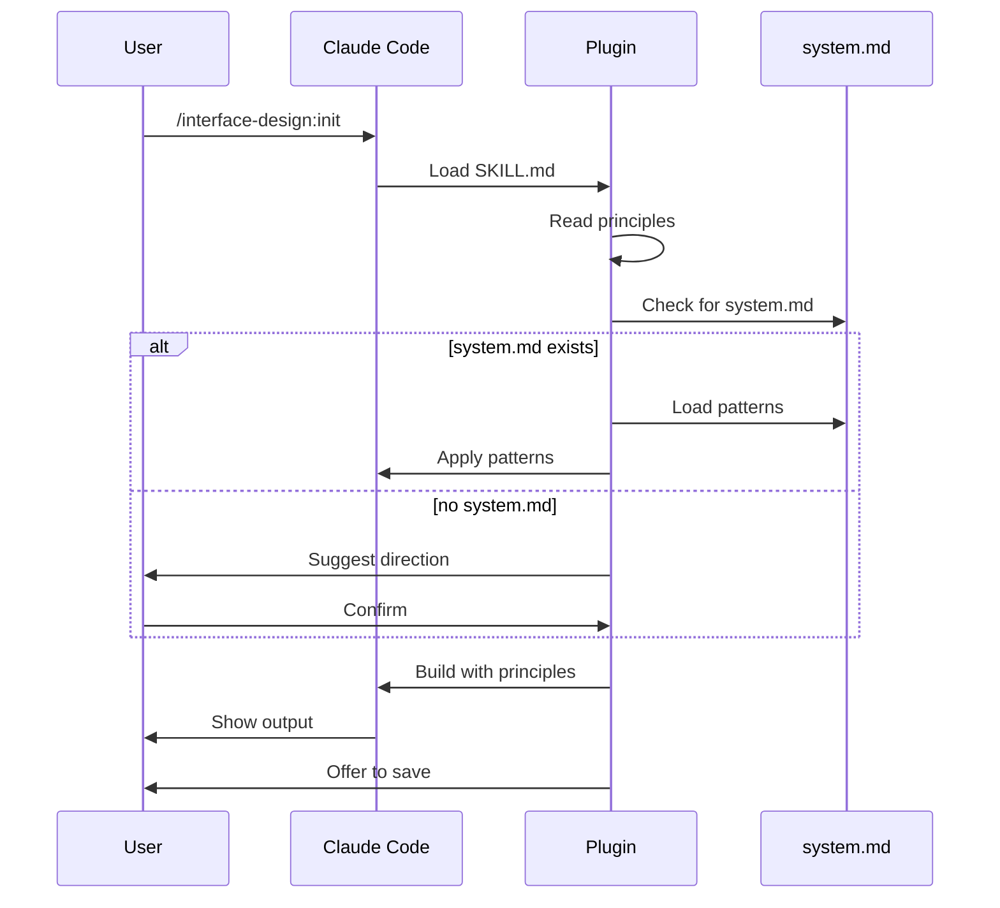
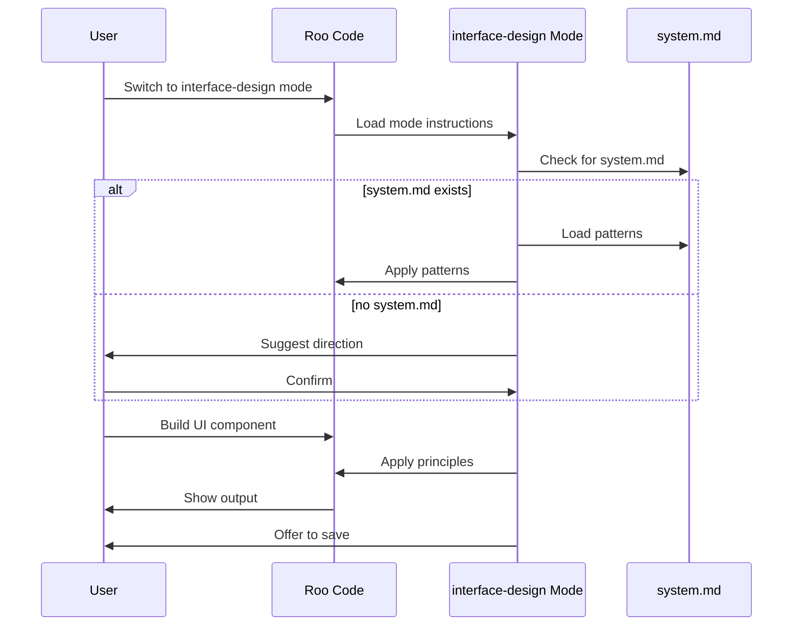
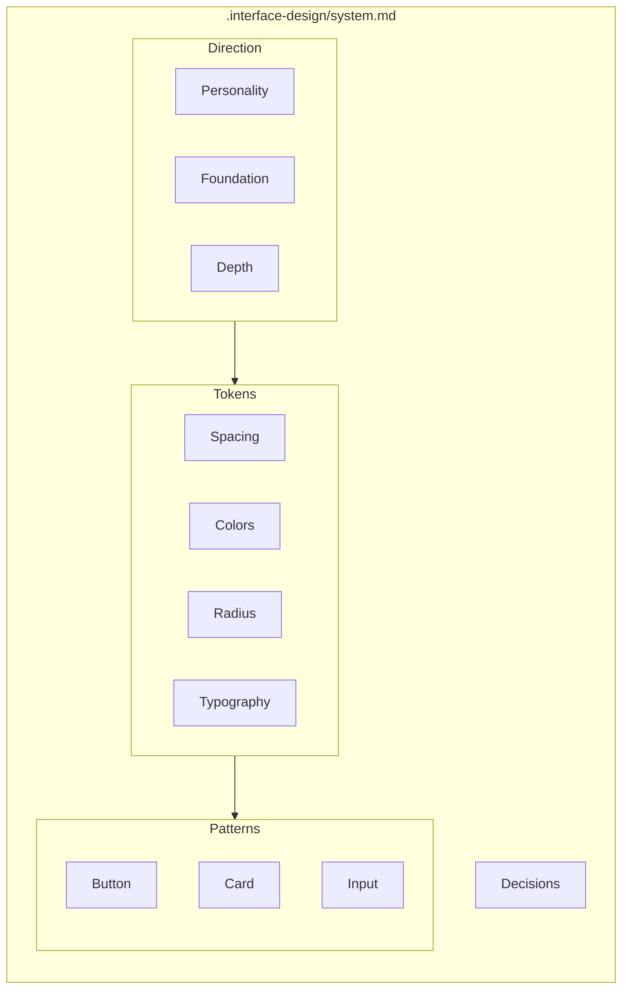
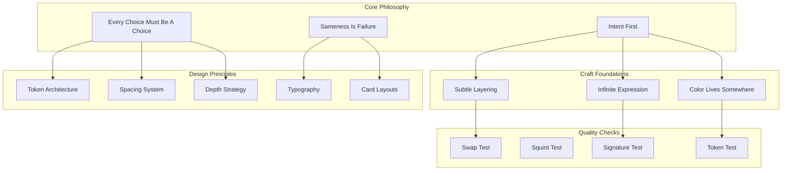
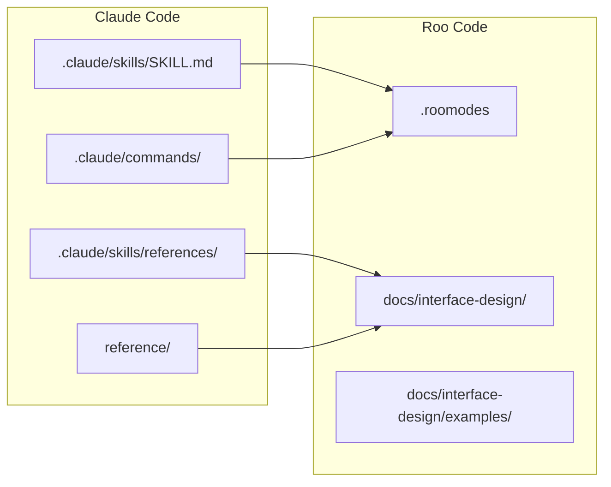

# Interface Design - Architecture Diagrams

## Claude Code Plugin Architecture

## Roo Code Mode Architecture

## Workflow Comparison

### Claude Code Workflow

### Roo Code Workflow

## System File Structure

## Design Principles Hierarchy

## File Mapping

